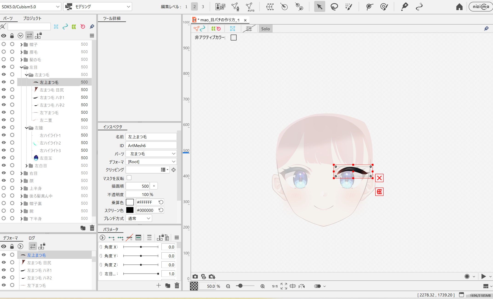
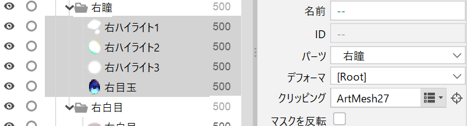

### インストール

早速ダウンロードしてみましょう。
https://www.live2d.com/cubism/download/editor/

今回の講習会では、free版のみで可能な範囲で作業を行います。

## 今回やること

モデルに瞬きのモーションをつけていきます。

モデルファイル: https://docs.live2d.com/cubism-editor-tutorials/eye-blink/

今回の講習会は以下の動画の内容に沿って行います。

動画: https://www.youtube.com/watch?v=ewkcJDcJZYI

### ファイルの読み込み

Live2D Cubism Editor を起動して、Free版を選択してください。
そのあと、先ほどダウンロードしたファイルから mao*目パチの作り方*インポート.psd をドラッグ&ドロップでインポートしてください。
解像度は1/2にしましょう。

### 使うものの説明

1. オブジェクト一覧
   各オブジェクトの非表示やロック、ファイル管理などができる。（モデルダウンロード時はレイヤー構造のまま）

2. パラメータ
   それぞれの動きを設定できる。いっぱいあるが、これらは[標準パラメータ](https://docs.live2d.com/cubism-editor-manual/standard-parameter-list/)として定められたものなので、あまり削除しない方が良い。

3. メッシュの手動編集
   イラストの変形に用いるメッシュを追加・変更できる。Live2Dの基礎。

4. メッシュの自動編集
   メッシュを自動で追加してくれる。楽。

5. 矢印ツール
   オブジェクトの移動や矩形選択ができる。

6. 変形パスツール
   メッシュをまとめて動かすことのできる変形パスを追加・変更できる。
   (https://md.trap.jp/uploads/upload_1f41ca9bc994f539feb6a3fdfc623431.png)

## 下準備

### いらない部分を非表示化しよう

今回はまばたきをつけるため、「右目」「左目」「顔」以外のオブジェクトフォルダを非表示化しましょう。
非表示化は、オブジェクト一覧の目マークを右クリックすることで行えます。（押しっぱなしスライドで一括非表示もできる）

### クリッピングしてみよう

よく見てみると、瞳が眉毛の下に飛び出てしまっています。
なので、クリッピングをして、瞳が白目よりも外側に表示されないようにしましょう。

（右・左）瞳フォルダの**子ファイルのみ**
をすべて選択(shift長押し+クリックで一括選択できます)して、インスペクタのクリッピングから（右・左）白目ファイルを選択してください。（下三角の部分をクリックすることで項目が表示されます。）

