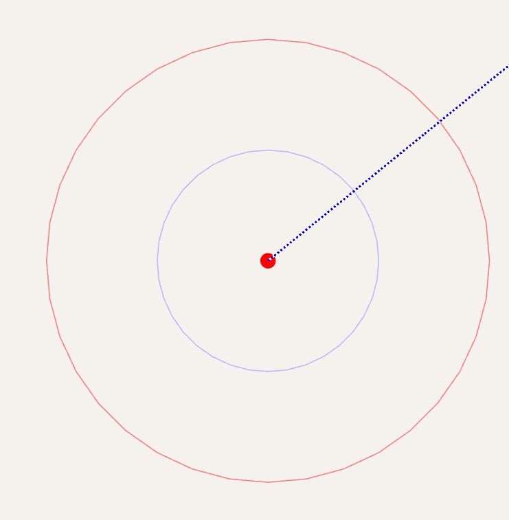
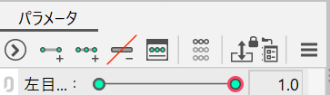

### 目を閉じてみよう

いよいよ実際に変形させて行きます！

#### 変形パスツールを使ってみよう

Live2Dでは、頂点を移動させて変形を表現します。しかし、一つ一つ変更させると膨大な手間がかかります。なので、変形パスを用いて線的な表現をします。

画面右上の「変形パスツール」（線に二重丸があるもの）を選択してください。
右上まつ毛を選択して、端から端まで5,6個変形パスを置いてみましょう！

ここで、変形パスには線変形の幅と硬さの二種類のパラメータがあります。幅は変形パスの影響範囲を表します。小さすぎるとほとんど動かなくなるので、ある程度の大きさ（ひとまずは、そのままか、変形パスの赤い円が隣のコントロールポイント（緑の点）に重なる+アルファくらい）にしておきましょう。

次に、「編集レベル」を変更してみましょう。編集レベルが大きいほど、おおざっぱな編集ができます。
画面中央上部の編集レベルを3に（初期状態は2です）してみましょう。
その状態で、変形パスを3個置いてみましょう。

同様に、二重、白目、目玉にも変形パスを追加していきましょう。
白目、目玉は円形に変形パスを追加することになります

#### 動かしてみよう

オブジェクトに動きをつけていきましょう。
右上まつ毛を選択して、右目 開閉パラメータのつまみを左端に（数値を0.0に）してください。
この状態が目を閉じた状態になるように、今から変形させていきます。

ここで大切なこととして、大きな変更を優先的にしていきましょう。
例えば、頂点をいちいち編集するよりも、変形パスを一回移動させた方が手間が減りますし、全体的なバランスも保ちやすいです。
また、見た目のきれいさよりも、メッシュのきれいさを見ながら変形しましょう。
変形操作はあまり直感的な挙動をしないことがあります。
まずはメッシュが崩壊しないことを意識して操作をして、一番最後に見た目を整えていきましょう。

:::warning
パラメータにキーを追加しているか、都度確認してください！！！
:::

- 上まつ毛
  - 一番大きく変化します
  - まずは「バウンディボックス」（オブジェクトの赤い枠）を、白目の下のあたりまでおろしましょう。
  - 編集レベルを3にして、弧の向きを上下逆にしましょう。また、この時、外側の変形パスを、目頭のほうへ寄せると自然になります。
  - あとは、編集レベルを下げつつ、なめらかな曲線になるように変形しましょう。
  - 端はあまり動かないことを意識するとよいかもしれません。

- 二重
  - 上まつ毛と同様です。
  - 上まつ毛に比べてまっすぐになる傾向があります。
- まつ毛 ハネ
  - 特に変形させないので、ボックスで移動させましょう。
  - まつ毛に合わせて、横方向に移動させたり、回転させたり（ボックス頂点の少し外をクリック長押し）してもよいでしょう。
- 白目
  - まつ毛の中に隠します。
  - まつ毛の形に添わせるときれいになります
  - クリッピングしているので、目玉、ハイライトは自動的に見えなくなります。
- まつげ 目尻
  - 白目に添いながら、まつ毛の中に隠します。
- 下まつ毛
  - まつ毛の中に隠します。
  - 少し上に動かします。
- ハイライト
  - 少し下げる動きをつけると、半目でもハイライトが見えてよいです。

## 演習

左目も動かしてみましょう！
